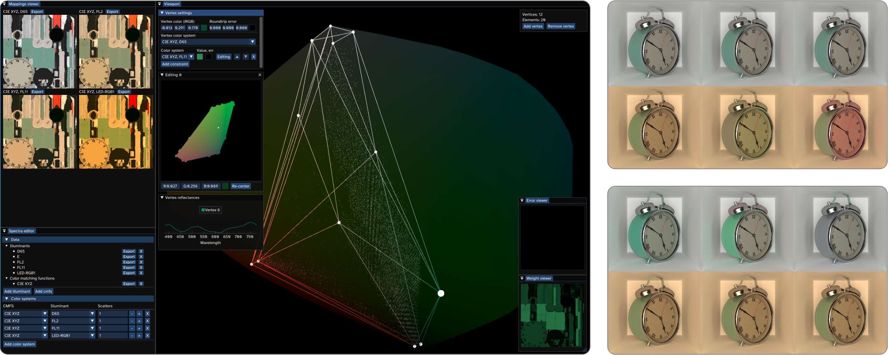
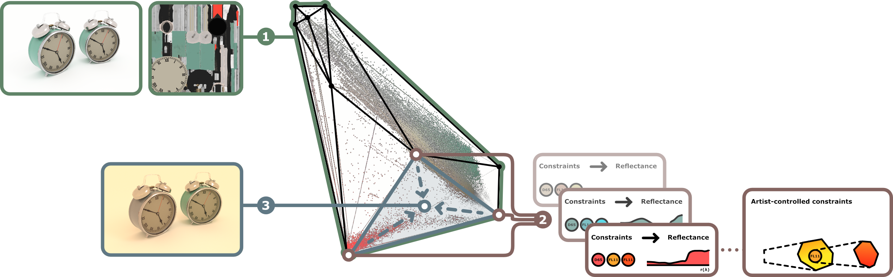

## Abstract

Spectral rendering is a crucial solution for photorealistic rendering.
However, most available texture assets are RGB-only, and access to spectral content is limited.
Uplifting methods that recover full spectral representations from RGB inputs have therefore received much attention.
Yet, most methods are deterministic, while, in reality, there is no one-to-one mapping.
As a consequence, the appearance of uplifted textures is fully determined under all illuminants.
Hereby, metamers, which are materials with differing spectral responses that appear identical under a specific illumination, are excluded.
We propose a method which makes this uplifting process controllable.
Hereby, a user can define texture appearance under various lighting conditions, leading to a greatly increased flexibility for content design.
Our method determines the space of possible metameric manipulations and enables interactive adjustments, while maintaining a set of user-specified appearance constraints.
To achieve this goal, we formulate the problem as a constrained optimization, building upon an interpolation scheme and data-based reflectance generation, which maintain plausibility.
Besides its value for artistic control, our solution is lightweight and can be executed on the fly, which keeps its memory consumption low and makes it easy to integrate into existing frameworks.

## Overview

Photorealistic rendering with multiple scenes is an involved process for CG artists. It is hard to consider the right appearance of an object under not just one, but several lights; sunlight, LEDs, etc. With regular RGB rendering, artists have little choice but to rework materials to get the look just right everywhere. More advanced spectral rendering should solve this problem, but in truth only complicates it. Now, artists can either deal with costly spectral material acquisition, or use spectral uplifting. Uplifting, unfortunately, is usually deterministic, and provides little control for artists.

{: .page__image }

With our toolkit, artists can configure and constrain a spectrally uplifted material appearance for several lights/sensors. Under the hood, we generate a simplified convex hull around the RGB texture data in some linear color space. For each vertex of this hull, we generate a spectral reflectance, using the vertex' position in this color space as input. Artists can then add constraints to this generation process, allowing them to specify how vertex reflectances behave in different color systems. Finally, we transfer vertex reflectances back to the RGB texture using generalized barycentrics. This last step is handled during rendering, as it boils down to a dot product between vertex reflectances and these precomputed barycentrics.

{: .page__image }

Our approach shows that spectral measurements are unnecessary to achieve an artist's intended vision under different light sources. We use several methods from colorimetry to ensure that our work remains mathematically and physically valid. As a result, our created upliftings do not differ significantly from actual spectral measurements.

This was a fun project to work on, as there was a not insignificant amount of work involved in making this run nicely on a regular computer. The result allows you to create CG imagery that hasn't been seen before, like logos that are invisible under certain lights. There's really a lot of artist possibility in creating your own spectral textures.

