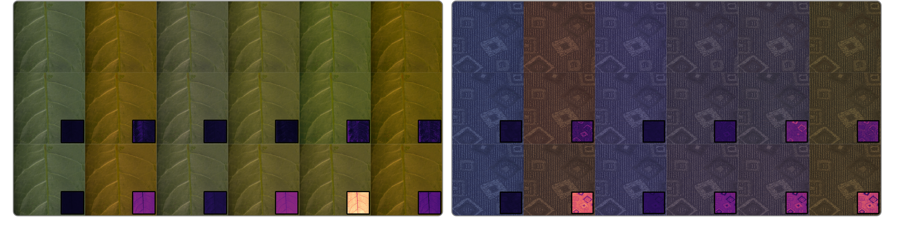

## Abstract

Spectral rendering is a crucial solution for photorealistic rendering. However, most available texture assets are RGB-only, and access to spectral content is limited. Uplifting methods that recover full spectral representations from RGB inputs have therefore received much attention. Yet, most methods are deterministic, while, in reality, there is no one-to-one mapping. As a consequence, the appearance of uplifted textures is fully determined under all illuminants. Hereby, metamers, which are materials with differing spectral responses that appear identical under a specific illumination, are excluded. We propose a method which makes this uplifting process controllable. Hereby, a user can define texture appearance under various lighting conditions, leading to a greatly increased flexibility for content design. Our method determines the space of possible metameric manipulations and enables interactive adjustments, while maintaining a set of user-specified appearance constraints. To achieve this goal, we formulate the problem as a constrained optimization, building upon an interpolation scheme and data-based reflectance generation, which maintain plausibility. Besides its value for artistic control, our solution is lightweight and can be executed on the fly, which keeps its memory consumption low and makes it easy to integrate into existing frameworks.

## Overview

Photorealistic rendering with multiple scenes is an involved process for CG artists. It is hard to consider the right appearance of an object under not just one, but several illuminants; sunlight, LEDs, fluorescents. With regular trichromatic rendering, artists have little choice but to rework materials to achieve color constancy in multiple scenes.

More advanced spectral rendering should solve this problem, but in truth only complicate it. Spectral rendering necessitates spectral materials, whose acquisition (and rendering) is laborious and costly. Spectral uplifting allows artists to use a trichromatic content pipeline. Unfortunately, uplifting methods are primarily deterministic: a single RGB color always results in the same reflectance. In this way, uplifting provides little control for artists.

{: .page__image }

With our toolkit, artists can author a spectral material through uplifting, constraining material appearance across several illuminants/sensors. The toolkit serves to demonstrate our uplifting method, and is accompanied by a *Mitsuba 3* plugin for rendering. The underlying method is simple and performant.

We first generate a simplified convex hull around input RGB texture data in some linear color space. For each vertex of this polytope, we generate a spectral reflectance, interpreting the vertex'position in this color space as input color. Artists can then add constraints to this generation process, allowing them to specify how vertex reflectances behave under different, secondary color systems. 

During rendering, we transfer vertex reflectances back to the RGB texture using precomputed generalized barycentrics. This boils down to a dot product between a small number of reflectances and these barycentrics.

{: .page__image }

Our approach demonstrates that spectral measurements are not necessary to achieve an artist's intended vision across a variety of scenes. To ensure results remain physically correct, we use prior work on metameric mismatching to constrain artist inputs to plausible regions. As a result, our created upliftings do not differ significantly from actual spectral measurements. In our paper, we successfully fit constraints to recover spectral images from the *HyTeXiLa* spectral texture dataset. In situations where a deterministic uplifting induces metameric mismatching, our method recovers a correct matching metamer.

{: .page__image }

This was an exciting project to work on, as there was a not insignificant amount of engineering involved in making the method performant on regular hardware. The resulting toolkit allows you to create imagery that hasn't been seen before. For example, logos that remain invisible under certain lights. There's really a lot of artist possibility in creating your own spectral textures.

